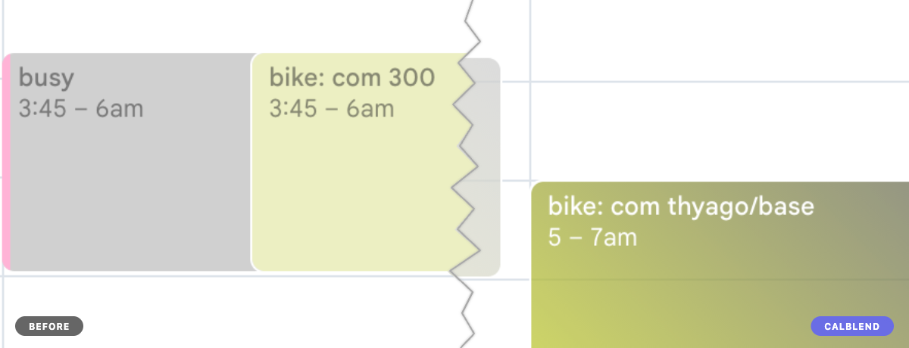

# CalBlend

Merges overlapping Google Calendar events from multiple calendars into a single event with a gradient background. No more unreadable stacked events.



## Features

- **Event merging** — overlapping events become one block with a gradient showing all calendar colors
- **Busy event support** — "busy" events from shared calendars are merged by position
- **Weekend highlighting** — customizable colors for weekends in both the main and mini calendar
- **Dark mode** — adapts borders and weekend colors automatically
- **21 languages** — Arabic, Chinese, English, French, German, Hindi, Italian, Japanese, Korean, Dutch, Polish, Portuguese, Romanian, Russian, Spanish, Thai, Turkish, Ukrainian, Vietnamese
- **Zero data collection** — everything runs locally, no external requests

## Install

### Desktop App

**macOS** (Homebrew):
```bash
brew install avelino/calblend/calblend@beta
```

**Windows** (Scoop):
```bash
scoop bucket add calblend https://github.com/avelino/scoop-calblend
scoop install calblend-beta
```

**Windows** (Winget):
```bash
winget install avelino.CalBlend.Beta
```

**Windows** (Chocolatey):
```bash
choco install calblend-beta
```

**Linux** (AUR):
```bash
yay -S calblend-beta-bin
```

**Linux** (Snap):
```bash
snap install calblend --edge
```

**Linux** (Flatpak):
```bash
flatpak install run.avelino.calblend
```

**Linux** (DEB/RPM) and **direct download** for all platforms:
[GitHub Releases](https://github.com/avelino/calblend/releases/tag/beta)

### Browser Extension

- [Chrome Web Store](#) *(coming soon)*
- [Firefox Add-ons](#) *(coming soon)*

## Development

Requirements: [Node.js](https://nodejs.org/) 22+, [pnpm](https://pnpm.io/)

```bash
pnpm install
pnpm dev            # Chrome with hot reload
pnpm dev:firefox    # Firefox with hot reload
```

### Commands

| Command | What it does |
|---------|-------------|
| `pnpm dev` | Start dev server (Chrome) |
| `pnpm dev:firefox` | Start dev server (Firefox) |
| `pnpm build` | Production build (Chrome) |
| `pnpm build:firefox` | Production build (Firefox) |
| `pnpm zip` | Build + zip for Chrome Web Store |
| `pnpm zip:firefox` | Build + zip for Firefox Add-ons |
| `pnpm test` | Run tests |
| `pnpm test:watch` | Run tests in watch mode |
| `pnpm typecheck` | TypeScript type check |

## Contributing

1. Fork the repo
2. Create a branch (`git checkout -b my-feature`)
3. Make your changes
4. Run `pnpm typecheck && pnpm test` — both must pass
5. Open a PR

### Guidelines

- **Tests required** — if you change behavior, add or update tests
- **TypeScript strict** — no `any`, no `ts-ignore`
- **Keep it simple** — this is a small extension, avoid over-engineering
- **One concern per module** — detection, grouping, merging, and rendering are separate for a reason

### Reporting bugs

Open an issue with:
- Browser and version
- What you expected vs what happened
- A screenshot if possible

## Architecture

```
MutationObserver (debounced, filtered to calendar nodes)
  -> restoreAll()           # clean DOM before re-reading
  -> findEvents(container)  # detect events, extract metadata
  -> groupEvents(events)    # group by title, regroup busy by position
  -> applyMerge(groups)     # gradient on kept event, hide duplicates
  -> colorWeekends()        # optional weekend highlighting
```

The observer disconnects before applying DOM changes and reconnects after, preventing infinite loops. A `restoreAll()` call before each cycle ensures we always read clean DOM state.

## Credits

Originally forked from [@imightbeAmy](https://github.com/nickhudkins/gradient-gcal-event-merge).

## License

[MIT](LICENSE)
